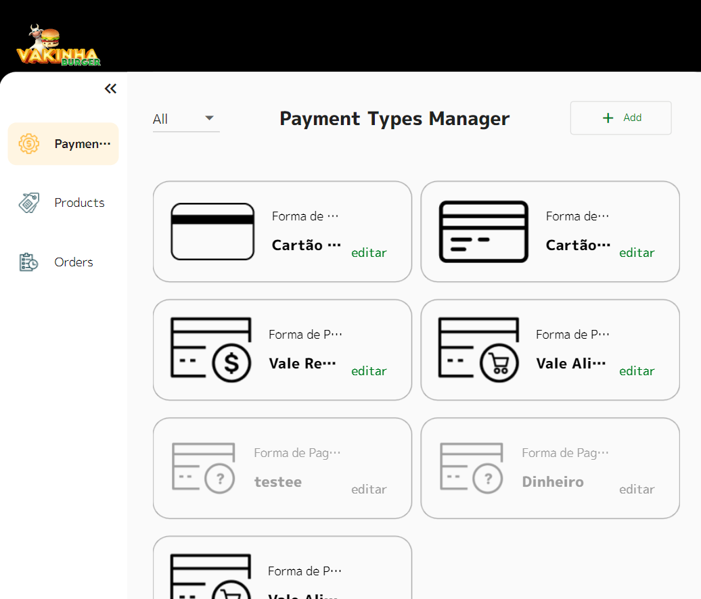
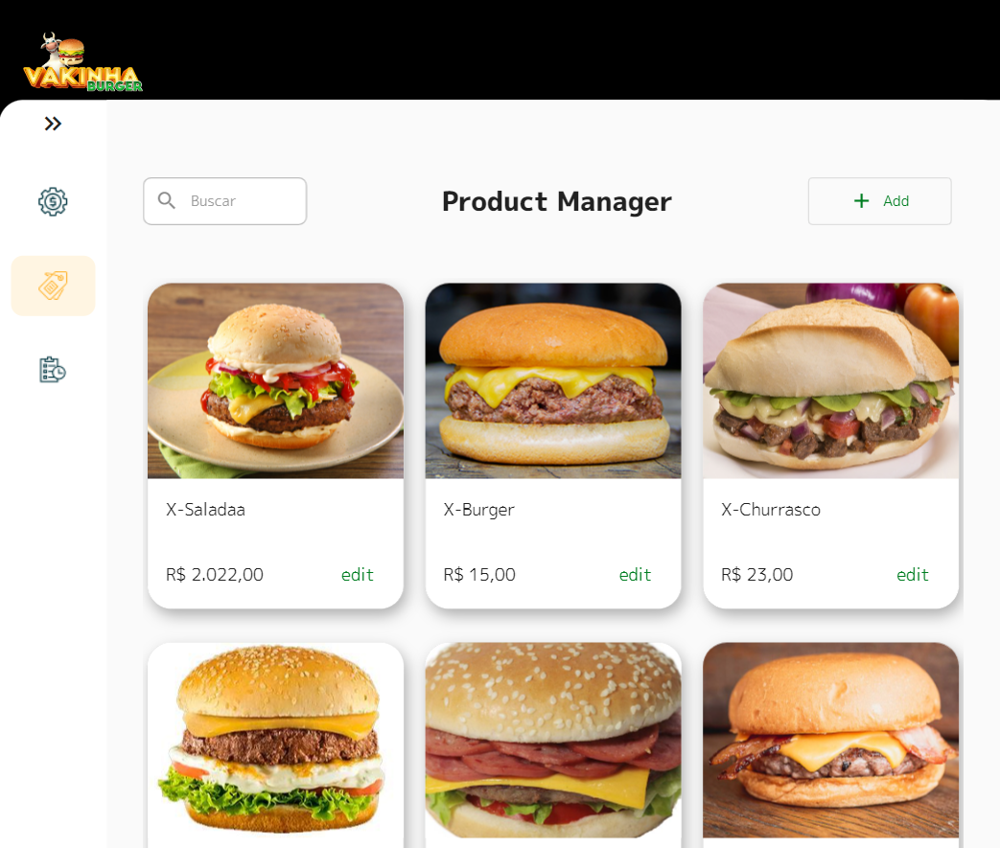
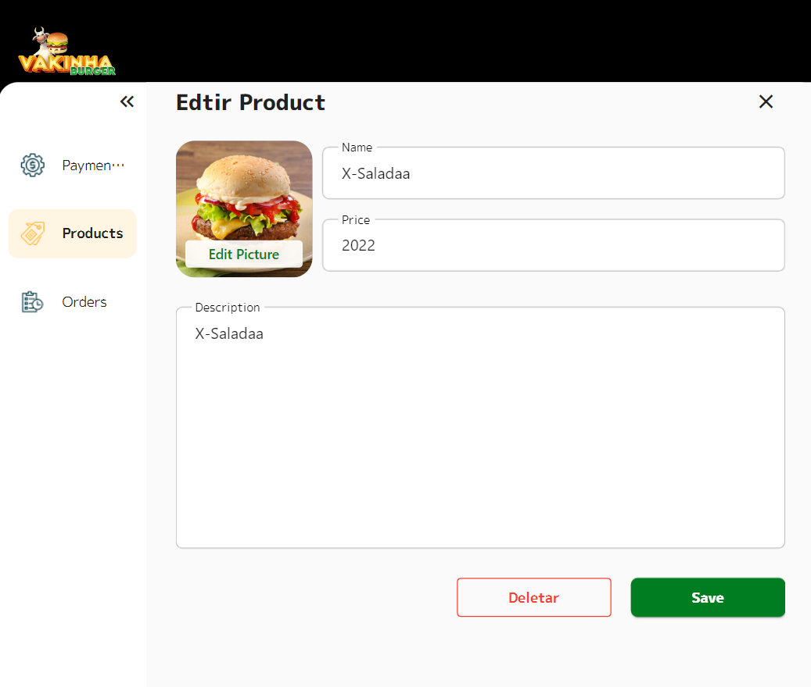
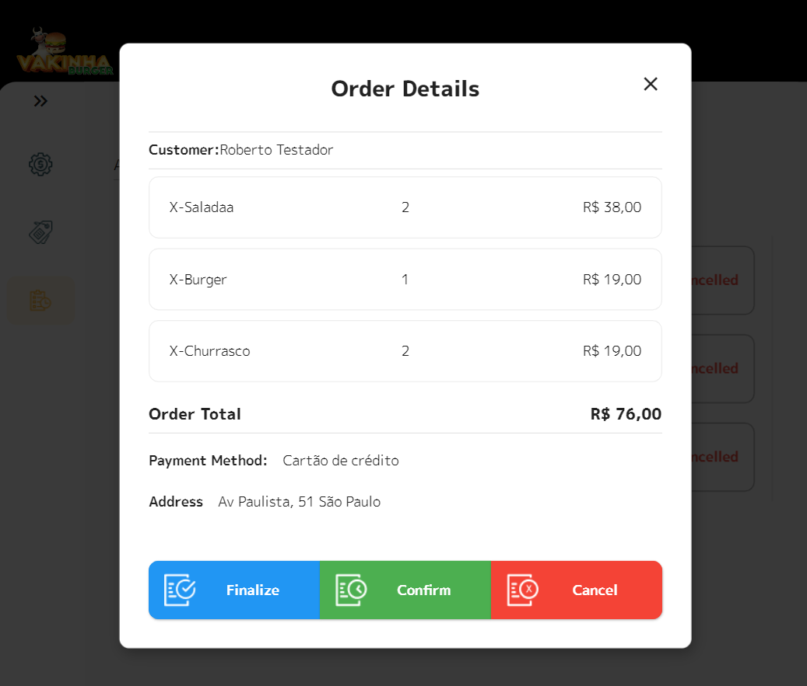
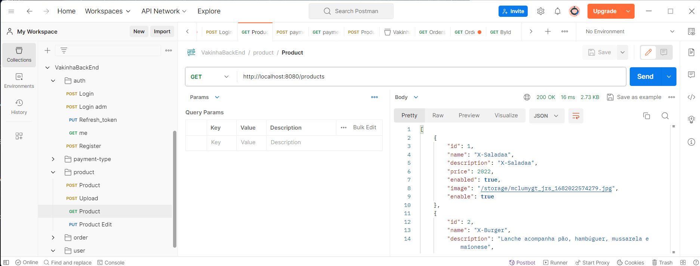
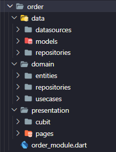
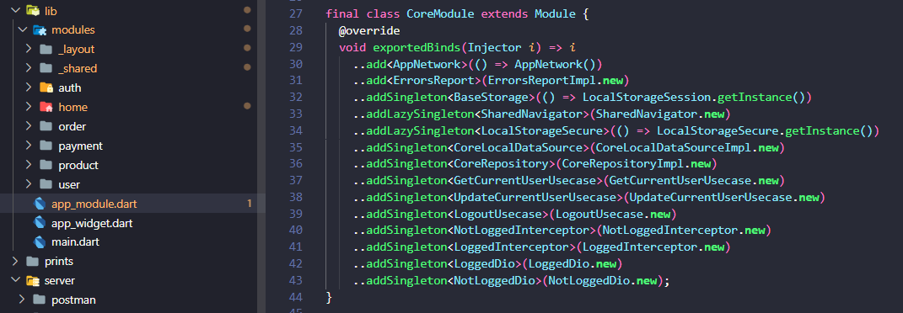
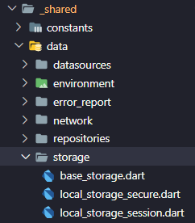
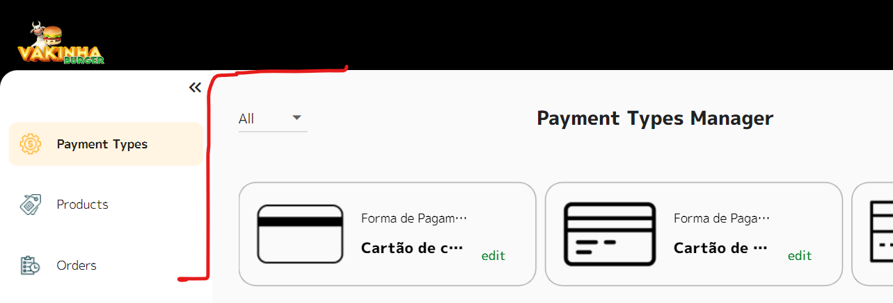

# Vakinha Burger WEB backoffice

<br />
<p align="center">
  
  
  
  
  
  
  
</p>

This project is an adaptation of a Flutter Web back-office solution created by [Rodrigo Rahman](https://novo.academiadoflutter.com.br/) during [Dart Week](https://dartweek.com.br/) event. The solution handles orders generated by a mobile application created in a previous version of the event, allowing people to place orders for burgers.

My contribution to this repository is to introduce clean architecture and state management using BLoC. The original project uses MVC+S (with a repository/service layer) and MobX for state management.

- [X] Version [English](README.md)
- [ ] Version [Portuguese](README_ptBR.md)
  

---
<br /><br />

## ✔️ Topics Covered  
 - Built with Flutter Web.
 - Clean architecture.
 - Modularization and dependency injection using Flutter Modular 6.
 - State management using the BLoC pattern.
 - User session management using JWT tokens.
 - File upload.
 - Form validation using the Validatorless package.
 - Interceptors for maintaining user sessions using Dio.
 - Nested navigation using the Modular RouterOutlet.
 - Responsiveness using Flutter's MediaQuery.
---
<br /><br />


## 🔗 Links 
Some links used in this project:
 - [Figma design](http://www.figma.com/file/fVcyjAmHwhrydVh98vJHT2/Vaquinha_adm_230402)
 - [JSON rest server](https://pub.dev/packages/json_rest_server)  
 - [Flutter Modular 6](https://modular.flutterando.com.br/)
 - [Package Validatorless](https://pub.dev/packages/validatorless)
 - [Package Brasil Fields](https://pub.dev/packages/brasil_fields)
 - [Academia do Flutter](https://novo.academiadoflutter.com.br/)
---
<br /><br />


## 📡 API Backend Local
To emulate a REST API that stores data, a tool called JSON Rest Server created by [Rodrigo Rahman](https://novo.academiadoflutter.com.br/) was used. 

The data is stored in the 'server' folder of this repository. Follow the steps below to start the service locally:
- [Json Rest Server](https://pub.dev/packages/json_rest_server)

```console
  // Install the rest server CLI
  dart pub global activate json_rest_server

  // Before running this command to emulate a tablet, you need to make the emulator understand localhost:
  adb reverse tcp:8080 tcp:8080

  // Start the service:
  cd [full path to this project]/server
  json_rest_server run

```
<br />

## 📡 Testing HTTP Requests and Responses
To understand the structure of the backend API, you can navigate to the /server/postman folder. There is a collection in JSON format to be accessed using the [Postman](https://www.postman.com/). 



<br /><br />

## 🖥️ Como executar esse projeto
Download this repository to your local machine and execute the execution routine in you [editor/IDE](https://docs.flutter.dev/tools/vs-code). Then follow the steps above to start the local API service using the JSON Rest Server. The pre-configured user as the system administrator is:
- User:     roberto@teste.com
- Password: 12345678

These details can be changed by manipulating the JSON file in the '/server/database.json' folder. Note that when changing the file, you need to restart the JSON Rest Server service for the change to take effect.

---
<br /><br />

 

## 🧩 Clean Architecture
Clean Architecture is an approach to designing software systems that emphasizes organizing code into well-defined layers, making the software more modular, testable, and easy to maintain. Additionally, Clean Architecture promotes the application of principles such as the Single Responsibility Principle and the Dependency Inversion Principle to create flexible and highly cohesive systems.

<br />
<p align="center">
  
</p>

More about clean arch: 
- [A good article on the topic](https://betterprogramming.pub/the-clean-architecture-beginners-guide-e4b7058c1165)
- [Another good article](https://blog.cleancoder.com/uncle-bob/2012/08/13/the-clean-architecture.html)
 
---
<br /><br />


## 🏷️ Modulos e Organização das Camadas
The idea behind using these approaches may seem initially complicated and may spread code across hundreds of files and folders. However, it makes sense for applications with the following requirements:

- Scalability: should be ready for new features.  
- Testing: should make easy to automate tests.
- Teams: should be easy to manage several groups of people changing the same code base.
- Reuse: should be simple reusing modules from other projects (e.g., shared, authentication, profile).
- MicroApp: should facilitates the conversion to micro-apps, where each module can become a package.


Modules/Functionalities / Layer Folders / Shared Module

<br />
<p align="left">
   
   
   
</p>

Below is an example of the Product module. Navigation and dependency injection:
When accessing a screen/page of a module, dependencies are loaded as needed. When leaving the screen, dependencies are removed from memory.


<br />
Note that a module can contain multiple screens/pages and even sub-modules if necessary.  
<br /><br />


For more basic dependencies shared by all modules, they can be described and exposed in the 'Core Module' concept. Note that these are classes such as http, local storage, shared navigation (centralizes navigation calls, making Modular navigation decoupled):



---
<br /><br />


## 🛠️ Shared Structures and Decoupling
Modules with an underscore (_) in their name are modules that serve other modules. The idea is to centralize the main dependencies so that they can be easily replaced, a concept known as decoupling.

 
<br />

The lower layers inject dependencies through their abstract classes, making it easy to replace packages such as Dio for HTTP requests or SharedPreferences for local data storage.


### Layouts e Menu
Another example of a module that is independent but only makes sense to serve other modules is the _layout module.



Flutter Modular offers a feature called RouterOutlet for nested navigation, where screen transitions occur in a specific space within the layout. Below is how the navigation between the routes of each module is defined and composed with the common layout among them.

<br />


Note that the authentication screen (route /auth) does not share the layout with other routes.

---
<br /><br />


## 👍🌟 Liked It?
If you liked it or found it useful, feel free to:
- Leave a star.
- Get in touch.
- Contribute with a pull request.
- Clone the repository.

---
<br /><br />


#
<footer>
  <p style="float:right; width: 30%;"> Copyright © Moacir Jacomin 
</p>
