# Vakinha Burger WEB backoffice

<br />
<p align="center">
  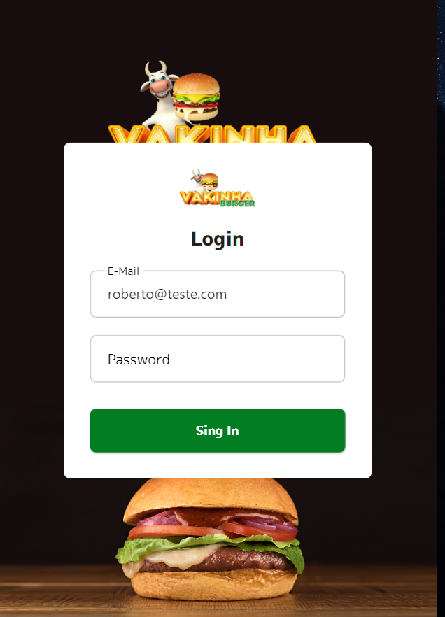
  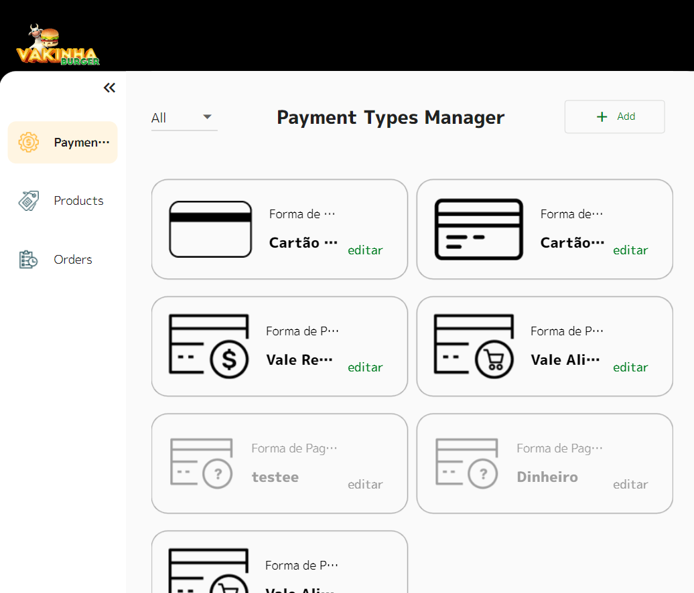
  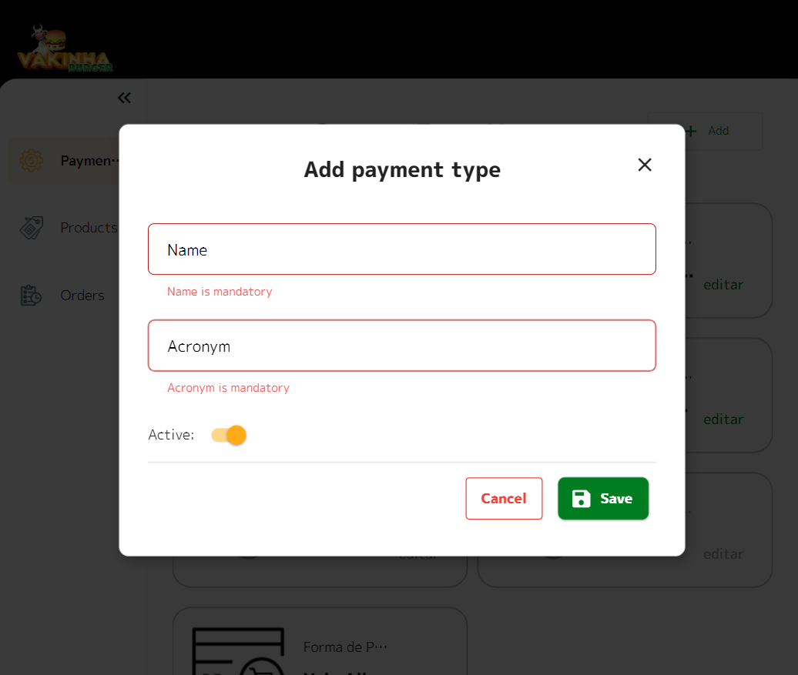
  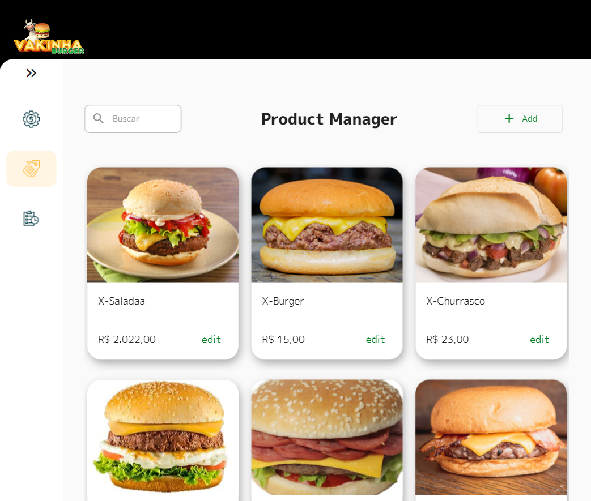
  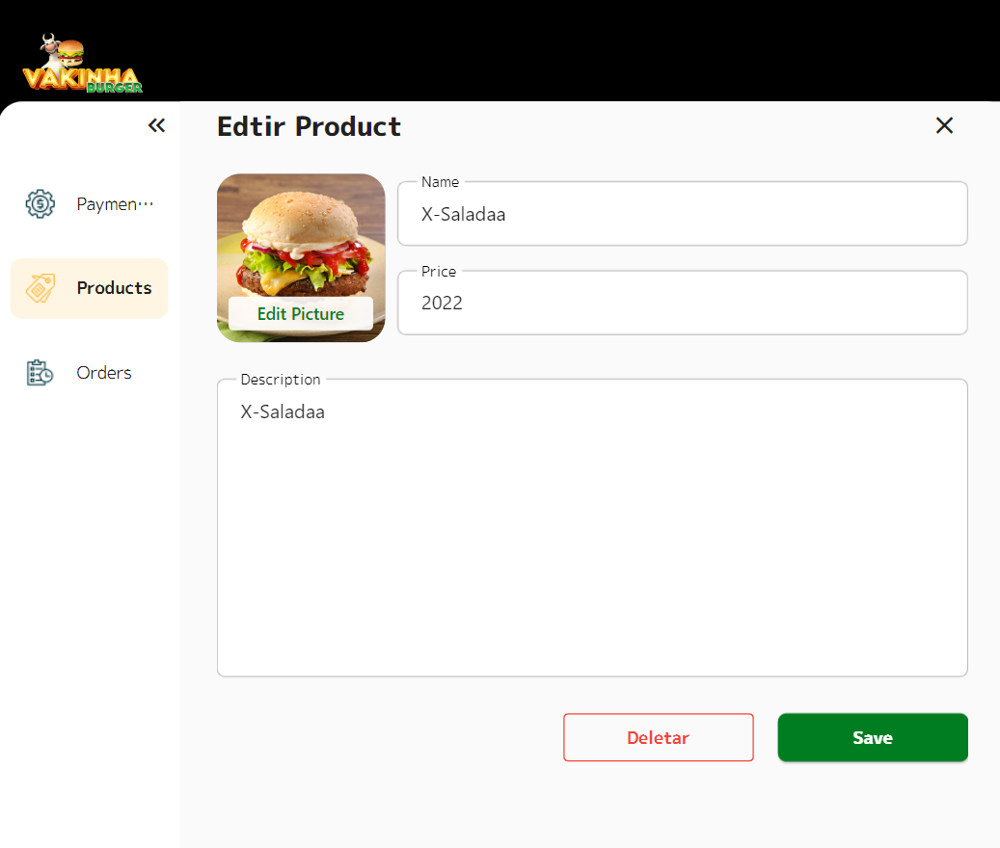
  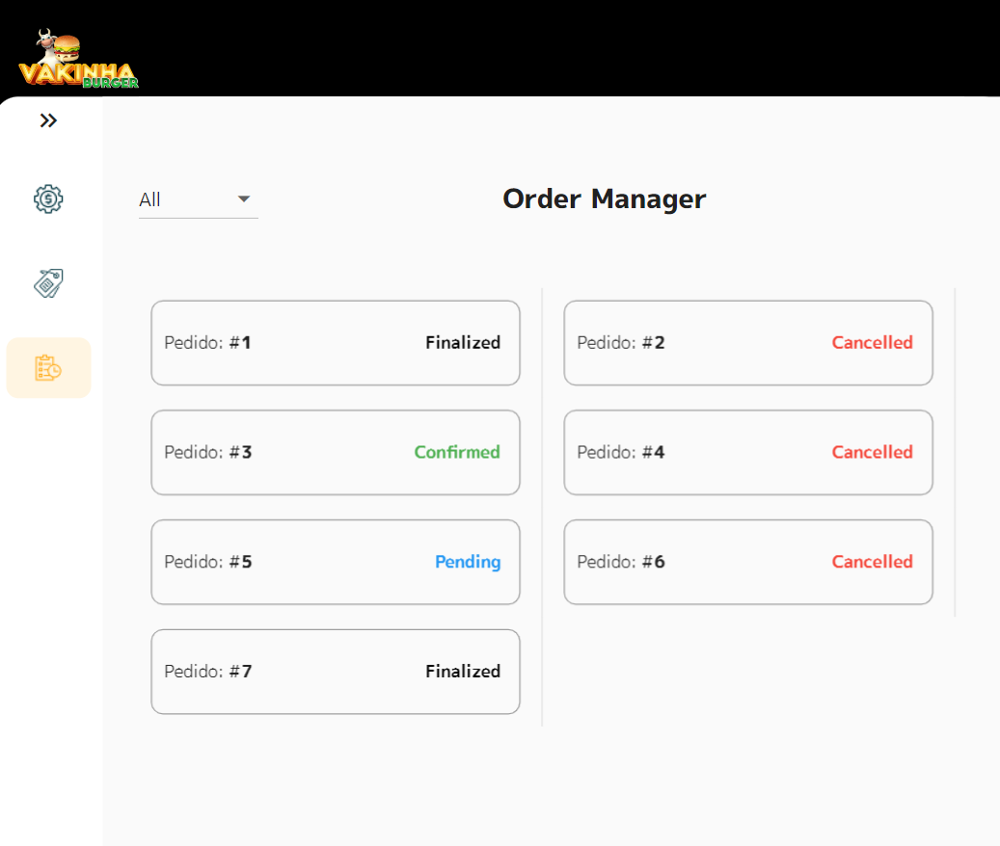
  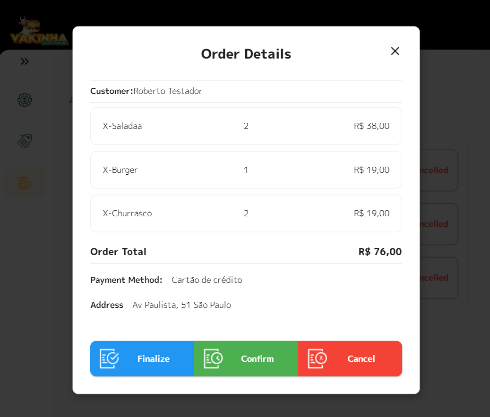
</p>

Esse projeto é uma adaptação de uma solução de back-office em flutter Web criada por [Rodrigo Rahman](https://novo.academiadoflutter.com.br/) durante o evento [Dart Week](https://dartweek.com.br/). A solução atende aos pedidos gerados por um aplicativo de celular criado em versão anterior do evento, em que as pessoas podem efetuar pedidos de lanches. 


Minha contribuição nesse repositorio é apresentar uma arquitetura limpa e o gerenciamento de estado BLOC. O projeto original utiliza MVC+S (+camada de repositorio/servico) e MobX para gestão de estado.

- [x] Versao [PT-Br](README_ptBR.md)
- [ ] Versao [Ingles](README.md)
  

---
<br /><br />

## ✔️ Tópicos Abordados  
 - Base em fluter Web.
 - Arquiterura limpa.
 - Modularização e injeção de dependencia usando Flutter Modular 6.
 - Gestão de estado usando padrão BLOC.
 - Sessão de acesso usando token JWT.
 - Envio de arquivos.
 - Validação de formularios usando pacote Validatorless.
 - Interceptadores para manter sessão de acesso usando Dio.
 - Navegação aninhada usando RouterOutlet do Modular. 
 - Responsividade com MediaQuery do flutter.
---
<br /><br />


## 🔗 Links 
Alguns links utilizados nesse projeto.
 - [Figma do Projeto](http://www.figma.com/file/fVcyjAmHwhrydVh98vJHT2/Vaquinha_adm_230402)
 - [JSON rest server](https://pub.dev/packages/json_rest_server)  
 - [Flutter Modular 6](https://modular.flutterando.com.br/)
 - [Pacote Validatorless](https://pub.dev/packages/validatorless)
 - [Pacote Brasil Fields](https://pub.dev/packages/brasil_fields)
 - [Academia do Flutter](https://novo.academiadoflutter.com.br/)
---
<br /><br />


## 📡 API Backend Local
Para emular uma API Rest que armazena os dados foi utilizado uma ferramenta chamada Json Rest Server
criada por [Rodrigo Rahman](https://novo.academiadoflutter.com.br/). 

Os dados estão armazenados na pasta 'server' desse repositorio. Siga os passos abaixo para iniciar o serviço localmente: 
- [Json Rest Server](https://pub.dev/packages/json_rest_server)

```console
  // instalar o rest server cli
  dart pub global activate json_rest_server

  // antes eh preciso rodar esse comando para emulador entender localhost (caso queira testar mulando um tablet)
  adb reverse tcp:8080 tcp:8080

  // iniciar o servico:
  cd [caminho completo desse projeto]/server
  json_rest_server run

```
<br />

## 📡 Como testar as requisições http e suas respostas
Para facilitar o entendimento da estrutura da API de backend navegue a pasta /server/postman. Há uma coleção em formato JSON a ser acessada pelo aplicativo [Postman](https://www.postman.com/). 


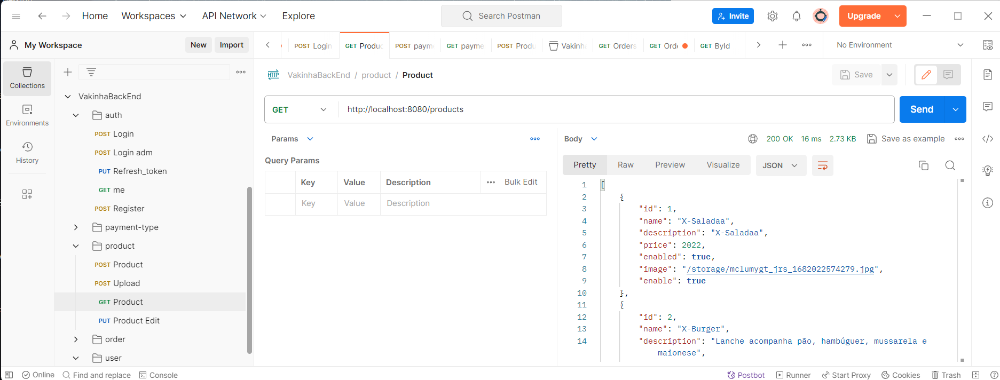
<br /><br />

## 🖥️ Como executar esse projeto
Baixe esse repositório para sua maquina e execute a rotina execução no seu [editor/IDE](https://docs.flutter.dev/tools/vs-code). Em seguida execute os passos acima para iniciar o serviço da API local usando Json Rest Server. O usuario pre-configurado como administrador do sistema: 
- usuario= roberto@teste.com
- senha= 12345678

Esses dados podem ser alterados manipulando o arquivo JSON da pasta '/server/database.json', apenas note que ao alterar o arquivo é preciso re-iniciar o serviço do Json Rest Server para que a alteração seja aplicada. 

---
<br /><br />

 

## 🧩 Arquitetura Limpa
Arquitetura Limpa é uma abordagem para projetar sistemas de software que enfatiza a organização do código em camadas bem definidas, tornando o software mais modular, testável e fácil de manter.
Além disso, a Arquitetura Limpa promove a aplicação de princípios como o Princípio da Responsabilidade Única (Single Responsibility Principle) e o Princípio da Inversão de Dependência (Dependency Inversion Principle) para criar sistemas flexíveis e de alta coesão

<br />
<p align="center">
  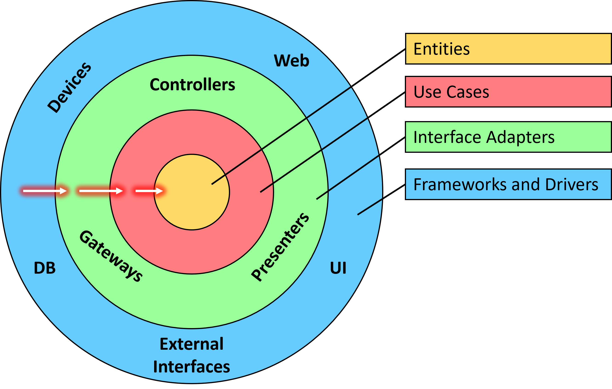
</p>

Para saber mais sobre arquitetura limpa: 
- [Um bom artigo sobre o tema](https://betterprogramming.pub/the-clean-architecture-beginners-guide-e4b7058c1165)
- [Outro bom artigo](https://blog.cleancoder.com/uncle-bob/2012/08/13/the-clean-architecture.html)
 
---
<br /><br />


## 🏷️ Modulos e Organização das Camadas
A ideia de uso dessas abordagens pode parecer de inicio muito complicada e que espalha código em centenas de arquivos e pastas. 
Mas na verdade uma solução que utlize modularização e arquitetura limpa faz sentido em uma aplicação com os seguintes requisitos:
- Escalavel: entende-se que haverá novas funcionalidades
- Teste: precisa ser simples a automatização dos testes  
- Times: haverá alguns grupos de pessoas trabalhando no mesmo código
- Aproveitamento: re-utilização de modulos de outros projetos (ex: shared, auth, profile) 
- MicroApp: facilita a conversao para micro-apps, cada modulo pode se tornar um pacote. 

Modulos/Functionalidades  / Pastas das Camadas / Modula Compartilhado

<br />
<p align="left">
  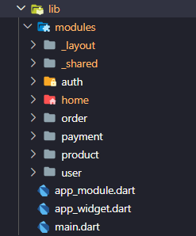 
  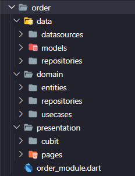 
  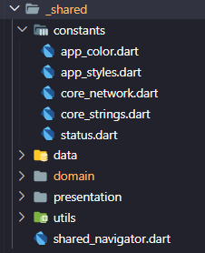 
</p>

Abaixo um exemplo, o modulo de Produto. Navegação e injeção de dependencias:
Ao acessar uma tela/pagina de um modulo, as dependencias são carregadas conforme a necessidade. Ao sair da tela as dependencias serão removidas da memória.

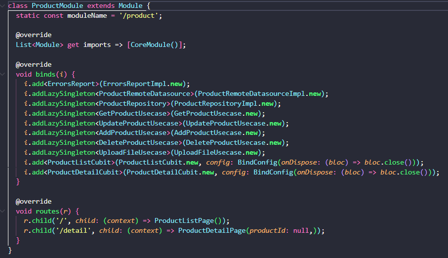
<br />
Note que um modulo pode conter diversas paginas, e ate sub-modulos se necessario. 
<br /><br />

Para dependencias mais básicas, compartilhadas por todos os modulos, pode ser descritas e expostadas no conceito 'Core Module'. Note que se trata de classes como http, local storage, shared navition (centraliza chamadas de navegacao, para que a navegacao do Modular seja desacoplavel): 

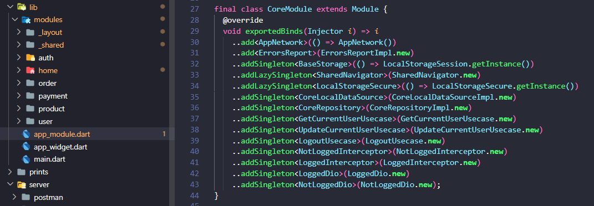

---
<br /><br />


## 🛠️ Estruturas Compartilhadas e Desacoplamento
Os modulos com o _ (underscore) em seu nome são modulos que atendem aos demais modulos. A ideia é centralizar as dependencias principais de forma que possam ser trocadas facilmente, o chamado desacoplamento. 

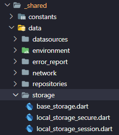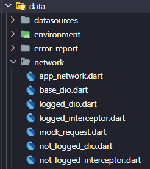 
<br />

As camadas inferiores injetam dependecias atraves de suas classes abstratas, tornando simples a substituição de pacotes como Dio para requisições http ou SharedPreference para armazenamento de dados local. 

### Layouts e Menu
Outro exemplo de modulo é independente mas que seu uso só faz sentido para atender a outros modulos, é o modulo _layout. 

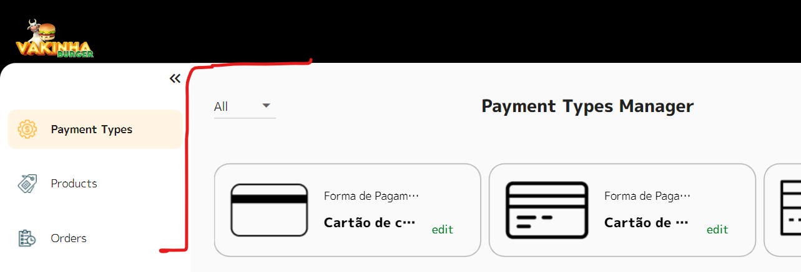

O flutter Modular apresenta uma funcionalidade chamada RouterOutlet para que exista uma navegação aninhada, a troca de tela deve se dar em um espaço especifico do layout. Veja abaixo como fica definida a navegação entre as rotas de cada modulo e a composicao com o layout comun entre elas. 

<br />
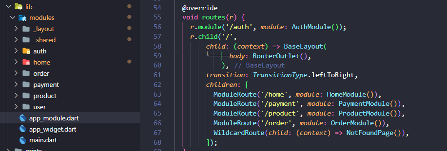

Note que a tela de autenticacao (rota /auth) na comportilha o layout com as demais rotas. 

---
<br /><br />


## 👍🌟 Gostou? 
Se gostou, se achou util, fique a vontade para: 
- Deixar uma estrela. 
- Entrar em contato.
- Contribuir com 'pull request'. 
- Clonar o repositorio.

---
<br /><br />


#
<footer>
  <p style="float:right; width: 30%;"> Copyright © Moacir Jacomin 
</p>
